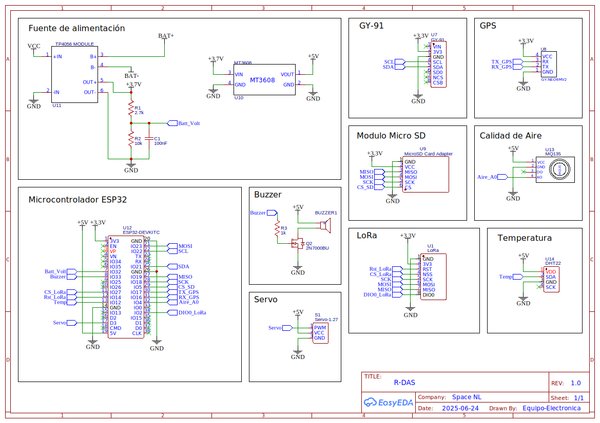

# Space_NL
Space NL nace como un proyecto ciudadano con el objetivo de diseñar y construir un cohete experimental de bajo costo, accesible y fácil de operar. Su propósito es impulsar la ciencia ciudadana, fomentar el aprendizaje en áreas STEM (ciencia, tecnología, ingeniería y matemáticas) y promover la democratización tecnológica.

# Componentes:

 **Number** | Name                                       | Designator | Footprint                                           | Quantity 
:----------:|:-----------------------------------------------:|:---------------------:|:-------------------------------------------------------------:|:-----------------:
 **1**      | ""BUZZER-12X9""                   | ""BUZZER1""           | ""BUZ-TH_BD12.0-P7.60-D0.6-FD"" | 1                 
 **2**      | ""100nF""                               | ""C1""           | ""RAD-0.1""                                         | 1                 
 **3**      | ""AUIRF3205-VB""                 | ""Q1""           | ""TO-220-3_L10.0-W4.6-P2.54-L"" | 1                 
 **4**      | ""2.7k""                                 | ""R1""           | ""R_AXIAL-0.4""                                 | 1                 
 **5**      | ""10k""                                   | ""R2""           | ""R_AXIAL-0.4""                                 | 1                 
 **6**      | ""1k""                                     | ""R3""           | ""R_AXIAL-0.4""                                 | 1                 
 **7**      | ""Servo-1.27""                     | ""S1""           | ""SERVO-1.27""                                   | 1                 
 **8**      | ""LoRa""                                 | ""U1""           | ""LORA-BREAKOUTBOARD""                   | 1                 
 **9**      | ""GY-91""                               | ""U2""           | ""GY-91""                                             | 1                 
 **10**     | ""GY-NEO6MV2""                     | ""U8""           | ""GY-NEO6MV2""                                   | 1                 
 **11**     | ""MicroSD Card Adapter"" | ""U9""           | ""MICROSD CARD READER""                 | 1                 
 **12**     | ""MT3608""                             | ""U10""         | ""MT3608_V2""                                     | 1                 
 **13**     | ""TP4056 MODULE""               | ""U11""         | ""TP4056""                                           | 1                 
 **14**     | ""ESP32-DEVKITC""               | ""U12""         | ""ESP32 DEVKITC V4 ESP32 WROOM 32D""                          | 1                 
 **15**     | ""MQ135""                               | ""U13""         | ""MQ135""                                             | 1                 
 **16**     | ""DHT22""                               | ""U14""         | ""SENSOR-TH_HAIGU_DHT22""             | 1                 

# Diagramas:

Esquemático:

2D:

