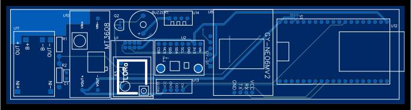

# 🚀 Space_NL

Space NL was born as a citizen project with the goal of designing and building a low-cost experimental rocket that is accessible and easy to operate. Its purpose is to promote citizen science, encourage learning in STEM areas (Science, Technology, Engineering, and Mathematics), and foster technological democratization.

# 📡 Rocket Telemetry System

This project implements a complete **telemetry system for experimental rockets**, consisting of hardware based on an **ESP32** and a desktop application in **Python (PyQt5)** for real-time data visualization and storage.

---

## ⚙️ Hardware

The system is built around an **ESP32**, which collects information from different sensors and transmits it.

## 🔩 Bill of Materials (BOM)

| **#** | **Name**                  | **Designator** | **Function / Description**                                                                | **Footprint**                                      | **Qty** |
|:-----:|---------------------------|:--------------:|-------------------------------------------------------------------------------------------|---------------------------------------------------|:------:|
| 1     | Buzzer-12x9               | BUZZER1        | Acoustic signaling                                                                        | BUZ-TH_BD12.0-P7.60-D0.6-FD                       | 1      |
| 2     | 100nF                     | C1             | Decoupling capacitor                                                                      | RAD-0.1                                           | 1      |
| 3     | AUIRF3205-VB              | Q1             | Power MOSFET                                                                              | TO-220-3_L10.0-W4.6-P2.54-L                       | 1      |
| 4     | Resistor 2.7k             | R1             | Voltage divider for battery measurement                                                   | R_AXIAL-0.4                                       | 1      |
| 5     | Resistor 10k              | R2             | Voltage divider for battery measurement                                                   | R_AXIAL-0.4                                       | 1      |
| 6     | Resistor 1k               | R3             | Current limiting for buzzer                                                               | R_AXIAL-0.4                                       | 1      |
| 7     | Servo-1.27                | S1             | Auxiliary mechanical actuation                                                            | SERVO-1.27                                        | 1      |
| 8     | LoRa Module               | U1             | Long-range wireless communication                                                         | LORA-BREAKOUTBOARD                                | 1      |
| 9     | GY-91 (IMU: MPU9250+BMP280)| U2             | Acceleration, gyroscope, magnetometer, and barometer                                      | GY-91                                             | 1      |
| 10    | GPS NEO-6M                | U8             | Position and velocity                                                                     | GY-NEO6MV2                                        | 1      |
| 11    | MicroSD Card Adapter      | U9             | Local data storage                                                                        | MICROSD CARD READER                               | 1      |
| 12    | MT3608                    | U10            | Step-up converter to 5V                                                                   | MT3608_V2                                         | 1      |
| 13    | TP4056 Module             | U11            | LiPo battery charger                                                                      | TP4056                                            | 1      |
| 14    | ESP32-DEVKITC             | U12            | Main microcontroller                                                                      | ESP32 DEVKITC V4 ESP32 WROOM 32D                  | 1      |
| 15    | MQ135                     | U13            | Air quality sensor                                                                        | MQ135                                             | 1      |
| 16    | DHT22                     | U14            | Temperature and humidity sensor                                                           | SENSOR-TH_HAIGU_DHT22                             | 1      |

---

## 🖇️ Diagrams

### 📷 **Schematic**:

### 📷 **2D Layout**:

---

## 🖥️ Software (Architecture)

The telemetry software is developed in **Python with PyQt5** and organizes the data flow into several layers:

### 1. **Hardware Layer**
- Sensors (IMU, GPS, MQ135, DHT22) send data to the **ESP32**, which packages it in **JSON/CSV** format.

### 2. **Serial Communication**
- A dedicated thread (**SerialReader Thread**) receives data in real time.  
- The **Data Parser** interprets the information and sends it to the rest of the application through Qt signals.

### 3. **Graphical User Interface (MainGUI)**
- Control panel: port selection, baud rate configuration, connection status.  
- Real-time data visualization:  
  - Air quality graph (MQ135).  
  - Temperature and humidity graph (DHT22).  
  - GPS position.  
  - IMU readings.

### 4. **Data Management**
- **CSV Writer**: automatic storage in timestamped files.  
- **Circular Buffer** and **Plot Timer**: efficient real-time data handling.

### 5. **Data Storage**
Data is saved in **CSV** files with the format:
- esp32_data_YYYYMMDD_HHMMSS.csv

---

## 📷 **Software Architecture**:

## 📷 **User Interface**:

